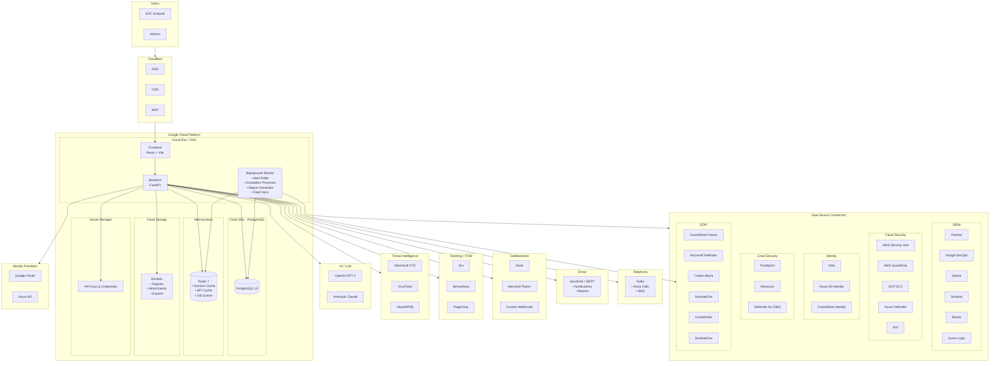
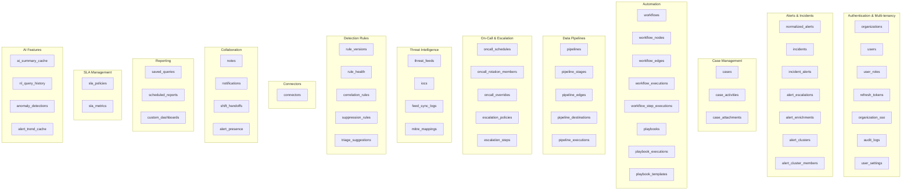
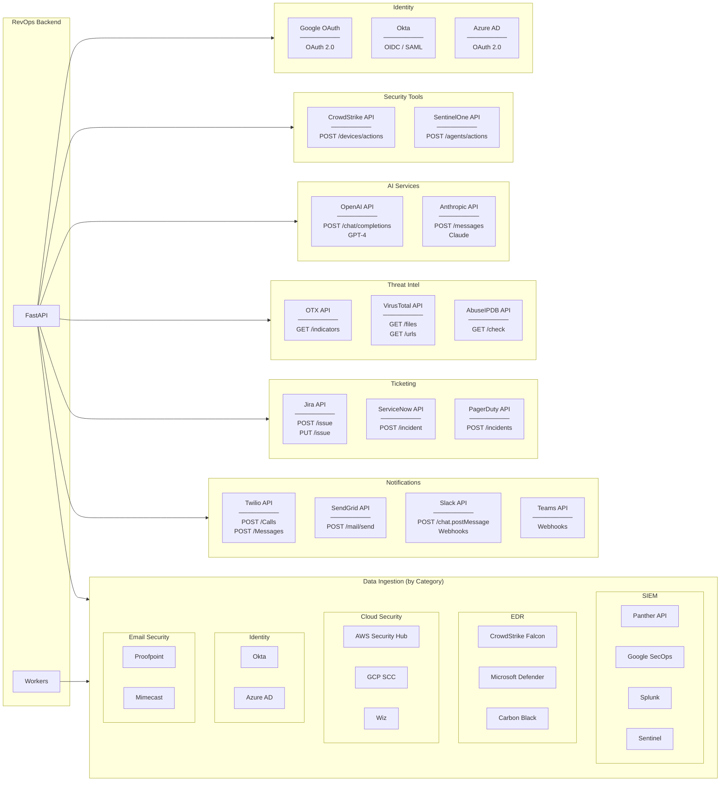

# RevOps SOC Platform - GCP + Cloudflare Architecture

## Full Infrastructure



## Database Schema

```mermaid
erDiagram
    organizations ||--o{ users : has
    organizations ||--o{ connectors : owns
    organizations ||--o{ normalized_alerts : stores
    organizations ||--o{ incidents : manages
    organizations ||--o{ cases : tracks
    organizations ||--o{ workflows : defines
    organizations ||--o{ pipelines : configures
    organizations ||--o{ escalation_policies : sets
    organizations ||--o{ oncall_schedules : schedules
    organizations ||--o{ playbooks : creates
    organizations ||--o{ correlation_rules : defines
    organizations ||--o{ sla_policies : enforces
    organizations ||--o{ custom_dashboards : builds
    organizations ||--o{ threat_feeds : subscribes

    users ||--o{ user_roles : has
    users ||--o{ saved_queries : owns
    users ||--o{ audit_logs : generates
    users ||--o{ user_settings : configures

    normalized_alerts ||--o{ incident_alerts : linked
    normalized_alerts ||--o{ alert_cluster_members : grouped
    normalized_alerts ||--o{ alert_enrichments : enriched
    normalized_alerts ||--o{ alert_escalations : triggers
    normalized_alerts ||--o{ notes : has

    incidents ||--o{ incident_alerts : contains
    incidents ||--o{ notes : has

    cases ||--o{ case_activities : logs
    cases ||--o{ case_attachments : has
    cases ||--o{ notes : has

    workflows ||--o{ workflow_nodes : contains
    workflows ||--o{ workflow_edges : connects
    workflows ||--o{ workflow_executions : runs

    pipelines ||--o{ pipeline_stages : contains
    pipelines ||--o{ pipeline_edges : connects
    pipelines ||--o{ pipeline_destinations : outputs
    pipelines ||--o{ pipeline_executions : runs

    escalation_policies ||--o{ escalation_steps : defines
    escalation_policies ||--o{ alert_escalations : triggers

    oncall_schedules ||--o{ oncall_rotation_members : includes
    oncall_schedules ||--o{ oncall_overrides : allows

    alert_clusters ||--o{ alert_cluster_members : groups

    threat_feeds ||--o{ iocs : contains
    threat_feeds ||--o{ feed_sync_logs : tracks
```



## Database Tables



## External Services Detail



## GCP Resources

| Service | Resource | Purpose |
|---------|----------|---------|
| **Cloud Run** | frontend | React dashboard |
| **Cloud Run** | backend | FastAPI server |
| **Cloud Run Jobs** | alert-poller | Sync alerts from Panther |
| **Cloud Run Jobs** | escalation-processor | Process escalation timers |
| **Cloud Run Jobs** | report-generator | Generate scheduled reports |
| **Cloud Run Jobs** | feed-sync | Sync threat intel feeds |
| **Cloud SQL** | PostgreSQL 15 | Primary database (80+ tables) |
| **Memorystore** | Redis 7 | Cache, sessions, job queue |
| **Cloud Storage** | revops-reports | PDF/CSV exports |
| **Cloud Storage** | revops-attachments | Case file attachments |
| **Secret Manager** | API keys | Twilio, OpenAI, Panther tokens |
| **Cloud Scheduler** | Cron triggers | Trigger Cloud Run Jobs |

## External Services Summary

| Category | Service | Purpose |
|----------|---------|---------|
| **SIEM** | Panther, Google SecOps, Splunk, Sentinel, Elastic, Sumo Logic | Security event aggregation |
| **EDR** | CrowdStrike Falcon, Microsoft Defender, Carbon Black, SentinelOne | Endpoint detections |
| **XDR** | Cortex XDR, Trend Vision One | Extended detection |
| **Cloud Security** | AWS Security Hub, GuardDuty, GCP SCC, Azure Defender, Wiz, Orca | Cloud posture & threats |
| **Identity** | Okta, Azure AD Identity Protection, CrowdStrike Identity | Identity threats |
| **Email Security** | Proofpoint, Mimecast, Defender for Office 365 | Email threats & phishing |
| **Network** | Darktrace, Vectra | Network detection |
| **Telephony** | Twilio | Escalation calls & SMS |
| **Email** | SendGrid / SMTP | Notifications, reports |
| **Chat** | Slack, Teams | Alert notifications |
| **Ticketing** | Jira, ServiceNow | Ticket creation |
| **Paging** | PagerDuty | On-call paging |
| **Threat Intel** | OTX, VirusTotal, AbuseIPDB | IOC enrichment |
| **AI** | OpenAI, Anthropic | Summaries, recommendations |
| **EDR** | CrowdStrike, SentinelOne | Host isolation actions |
| **SSO** | Google, Okta, Azure AD | User authentication |

## Estimated Monthly Cost

| Service | Spec | Cost |
|---------|------|------|
| Cloud Run (Frontend) | 2 instances | ~$20 |
| Cloud Run (Backend) | 2 instances | ~$40 |
| Cloud Run Jobs | 4 jobs | ~$15 |
| Cloud SQL | db.g1-small, 50GB | ~$35 |
| Memorystore | Basic 1GB | ~$35 |
| Cloud Storage | 20GB | ~$2 |
| Secret Manager | 20 secrets | ~$2 |
| Cloud Scheduler | 10 jobs | ~$1 |
| **GCP Total** | | **~$150/mo** |
| Cloudflare | Free tier | $0 |
| **External APIs** | | **Variable** |
| - Twilio | Pay per use | ~$20-50 |
| - SendGrid | Free tier 100/day | $0 |
| - OpenAI | Pay per use | ~$10-50 |

## Environment Variables

```bash
# GCP
GCP_PROJECT=revops-prod
GCP_REGION=us-central1

# Database
DATABASE_URL=postgresql+asyncpg://user:pass@/revops?host=/cloudsql/project:region:instance

# Redis
REDIS_URL=redis://10.x.x.x:6379

# SIEM - Panther
PANTHER_API_URL=https://api.panther.com
PANTHER_API_TOKEN=xxx

# Auth
JWT_SECRET=xxx
JWT_ALGORITHM=HS256

# SSO
GOOGLE_CLIENT_ID=xxx
GOOGLE_CLIENT_SECRET=xxx
OKTA_DOMAIN=xxx
OKTA_CLIENT_ID=xxx
OKTA_CLIENT_SECRET=xxx

# Telephony - Twilio
TWILIO_ACCOUNT_SID=xxx
TWILIO_AUTH_TOKEN=xxx
TWILIO_PHONE_NUMBER=+1xxx

# Email
SMTP_HOST=smtp.sendgrid.net
SMTP_PORT=587
SMTP_USER=apikey
SMTP_PASSWORD=xxx
SMTP_FROM_EMAIL=alerts@revops.example.com

# Slack
SLACK_WEBHOOK_URL=xxx
SLACK_BOT_TOKEN=xxx

# Jira
JIRA_URL=https://company.atlassian.net
JIRA_EMAIL=xxx
JIRA_API_TOKEN=xxx

# ServiceNow
SERVICENOW_INSTANCE=xxx
SERVICENOW_USER=xxx
SERVICENOW_PASSWORD=xxx

# PagerDuty
PAGERDUTY_API_KEY=xxx
PAGERDUTY_SERVICE_ID=xxx

# Threat Intel
OTX_API_KEY=xxx
VIRUSTOTAL_API_KEY=xxx
ABUSEIPDB_API_KEY=xxx

# AI
OPENAI_API_KEY=xxx
ANTHROPIC_API_KEY=xxx
LLM_PROVIDER=openai
LLM_MODEL=gpt-4

# CrowdStrike Falcon (Data Source + EDR Actions)
CROWDSTRIKE_CLIENT_ID=xxx
CROWDSTRIKE_CLIENT_SECRET=xxx
CROWDSTRIKE_BASE_URL=https://api.crowdstrike.com

# SentinelOne (EDR Actions)
SENTINELONE_API_KEY=xxx
SENTINELONE_URL=xxx
```
