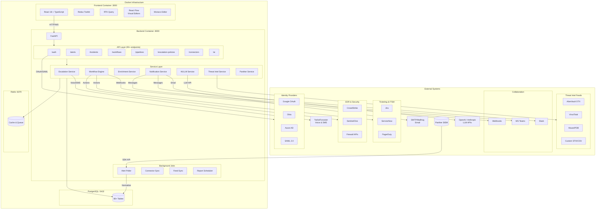
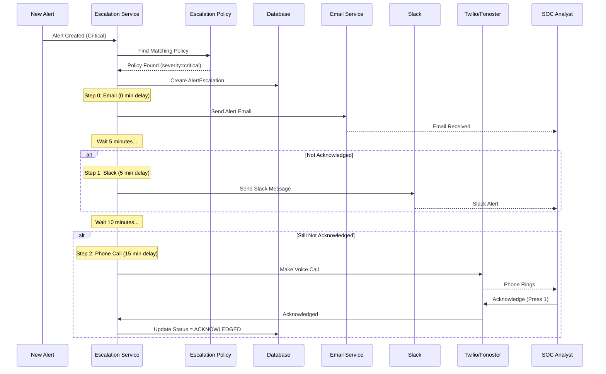
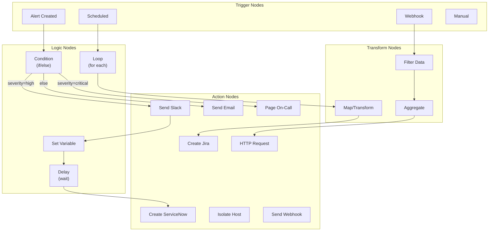
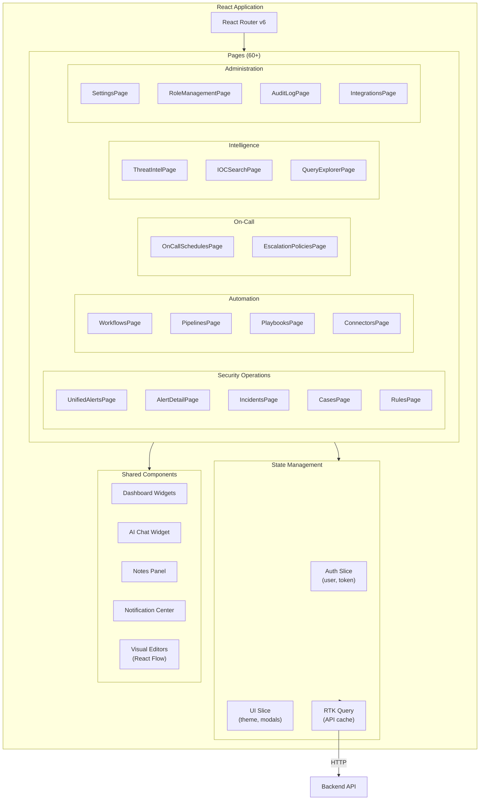
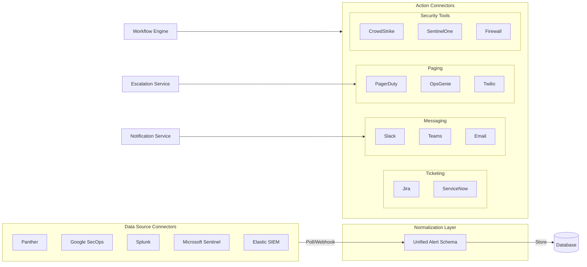
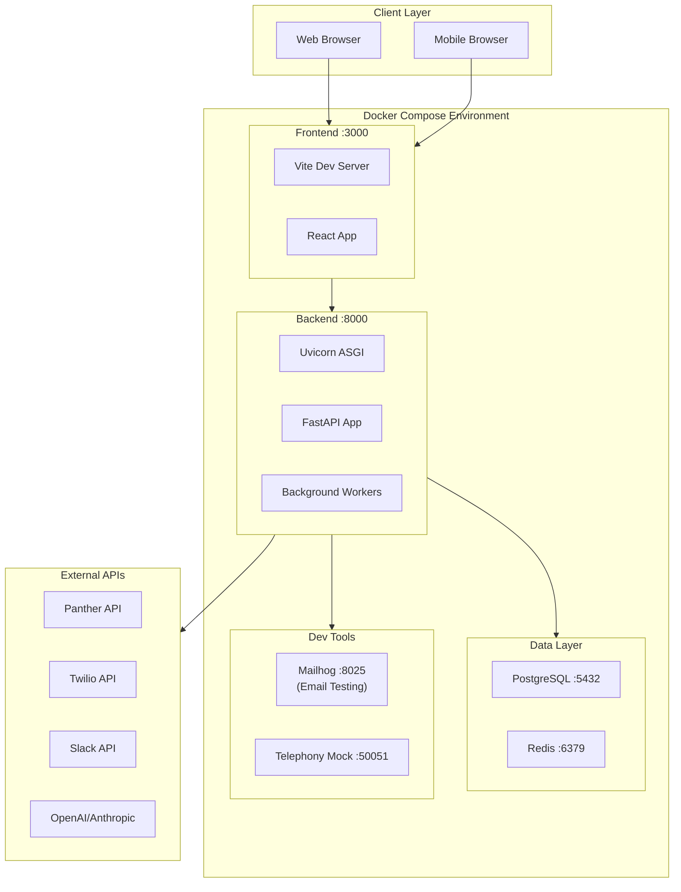

# RevOps SOC Platform Architecture

## System Overview

## Data Model Overview

```mermaid
erDiagram
    Organization ||--o{ User : has
    Organization ||--o{ Connector : owns
    Organization ||--o{ NormalizedAlert : stores
    Organization ||--o{ Incident : manages
    Organization ||--o{ Case : tracks
    Organization ||--o{ Workflow : defines
    Organization ||--o{ Pipeline : configures
    Organization ||--o{ EscalationPolicy : sets
    Organization ||--o{ OnCallSchedule : schedules

    NormalizedAlert ||--o{ IncidentAlert : "linked to"
    NormalizedAlert ||--o{ AlertClusterMember : "grouped in"
    NormalizedAlert ||--o{ AlertEnrichment : enriched
    NormalizedAlert ||--o{ AlertEscalation : triggers

    Incident ||--o{ IncidentAlert : contains
    Incident ||--o{ Note : has

    Case ||--o{ CaseActivity : logs
    Case ||--o{ CaseAttachment : has
    Case ||--o{ Note : has

    Workflow ||--o{ WorkflowNode : contains
    Workflow ||--o{ WorkflowEdge : connects
    Workflow ||--o{ WorkflowExecution : runs

    Pipeline ||--o{ PipelineStage : contains
    Pipeline ||--o{ PipelineEdge : connects
    Pipeline ||--o{ PipelineDestination : outputs
    Pipeline ||--o{ PipelineExecution : runs

    EscalationPolicy ||--o{ EscalationStep : defines
    EscalationPolicy ||--o{ AlertEscalation : triggers

    OnCallSchedule ||--o{ OnCallRotationMember : includes
    OnCallSchedule ||--o{ OnCallOverride : allows

    AlertCluster ||--o{ AlertClusterMember : groups

    User ||--o{ UserRole : has
    User ||--o{ AuditLog : creates
    User ||--o{ SavedQuery : owns
```

## Alert Processing Flow

```mermaid
flowchart LR
    subgraph Ingestion["1. Ingestion"]
        Panther[("Panther SIEM")]
        Poller["Alert Poller<br/>(Background Job)"]
        Normalize["Normalize &<br/>Store"]
    end

    subgraph Processing["2. Processing"]
        Enrichment["Enrichment<br/>Pipeline"]
        Correlation["Correlation<br/>Engine"]
        Clustering["AI Alert<br/>Clustering"]
    end

    subgraph Escalation["3. Escalation"]
        PolicyMatch["Match<br/>Policy"]
        Notify["Send<br/>Notifications"]
        Track["Track<br/>SLA"]
    end

    subgraph Response["4. Response"]
        Triage["Analyst<br/>Triage"]
        Playbook["Execute<br/>Playbook"]
        Workflow["Trigger<br/>Workflow"]
    end

    subgraph Resolution["5. Resolution"]
        CreateCase["Create<br/>Case"]
        CreateIncident["Create<br/>Incident"]
        Resolve["Resolve &<br/>Document"]
    end

    Panther --> Poller --> Normalize
    Normalize --> Enrichment --> Correlation --> Clustering
    Clustering --> PolicyMatch --> Notify --> Track
    Track --> Triage --> Playbook --> Workflow
    Workflow --> CreateCase --> Resolve
    Workflow --> CreateIncident --> Resolve
```

## Escalation Workflow

## Workflow Engine

## Frontend Architecture

## Connector Framework

## Deployment Architecture

## Key Database Tables

| Category | Tables |
|----------|--------|
| **Auth & Multi-tenancy** | Organization, User, UserRole, RefreshToken, OrganizationSSO, AuditLog |
| **Alerts & Incidents** | NormalizedAlert, Incident, IncidentAlert, AlertEscalation, AlertEnrichment |
| **Cases** | Case, CaseActivity, CaseAttachment |
| **Automation** | Workflow, WorkflowNode, WorkflowEdge, WorkflowExecution, Playbook, PlaybookExecution |
| **Pipelines** | Pipeline, PipelineStage, PipelineEdge, PipelineDestination, PipelineExecution |
| **On-Call** | OnCallSchedule, OnCallRotationMember, OnCallOverride, EscalationPolicy, EscalationStep |
| **Intelligence** | AlertCluster, AlertClusterMember, CorrelationRule, MitreMapping |
| **Threat Intel** | IOC, ThreatFeed, FeedSyncLog |
| **Rules** | RuleVersion, RuleHealth, TriageSuggestion |
| **Connectors** | Connector (unified for data sources & actions) |
| **Collaboration** | Note, Notification, ShiftHandoff, AlertPresence |
| **Reporting** | ScheduledReport, SavedQuery, CustomDashboard |
| **SLA** | SLAPolicy, SLAMetric |

## API Endpoints Summary

| Prefix | Purpose | Key Operations |
|--------|---------|----------------|
| `/auth` | Authentication | Login, logout, refresh, OAuth callbacks |
| `/alerts` | Alert management | List, get, update, bulk-update, comments |
| `/incidents` | Incident tracking | CRUD, link alerts, assign |
| `/cases` | Case management | CRUD, activities, attachments |
| `/workflows` | Workflow automation | CRUD, execute, history |
| `/pipelines` | Data pipelines | CRUD, execute, destinations |
| `/escalation-policies` | Escalation chains | CRUD, steps, trigger |
| `/oncall` | On-call schedules | CRUD, rotations, overrides |
| `/connectors` | Integrations | CRUD, test, sync |
| `/ai` | AI features | Summarize, correlate, suggest |
| `/threat-intel` | Threat intelligence | IOCs, feeds, search |
| `/rules` | Detection rules | CRUD, versions, health |
| `/analytics` | Dashboards & trends | Metrics, trends, anomalies |
| `/settings` | Configuration | Org settings, user prefs |
| `/presence` | Real-time collaboration | Heartbeat, viewers |
| `/shift-handoffs` | SOC handoffs | Create, acknowledge |
